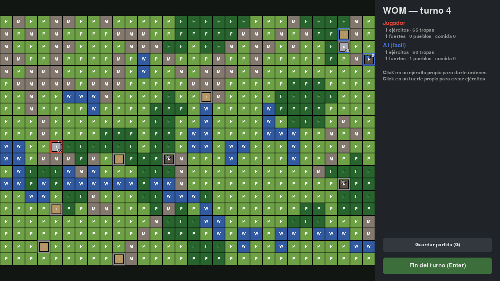
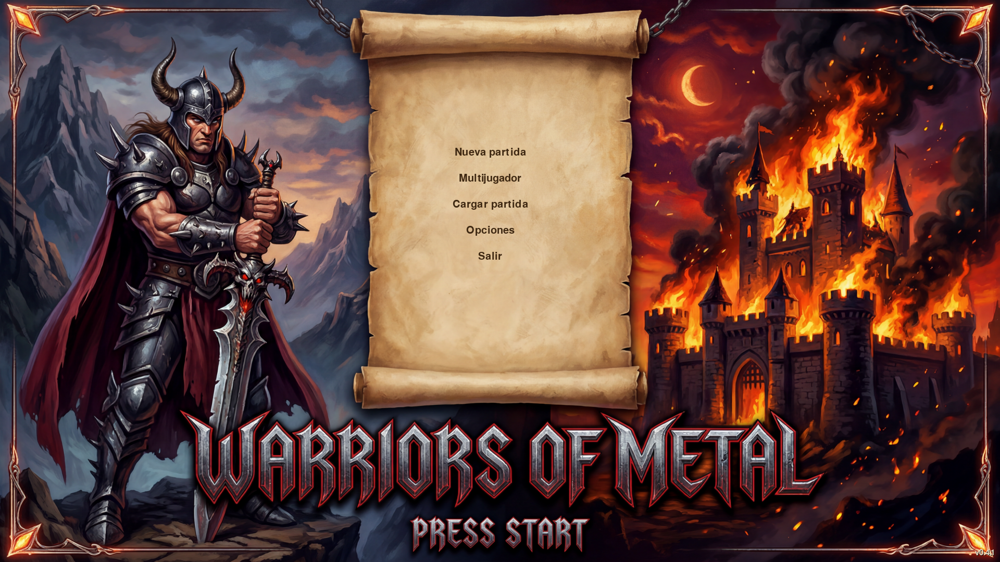
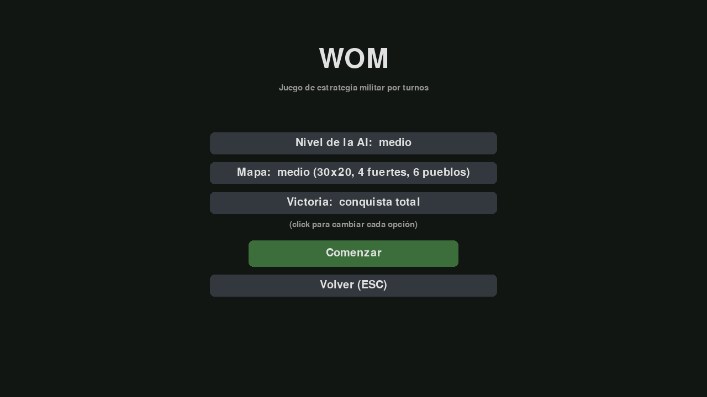
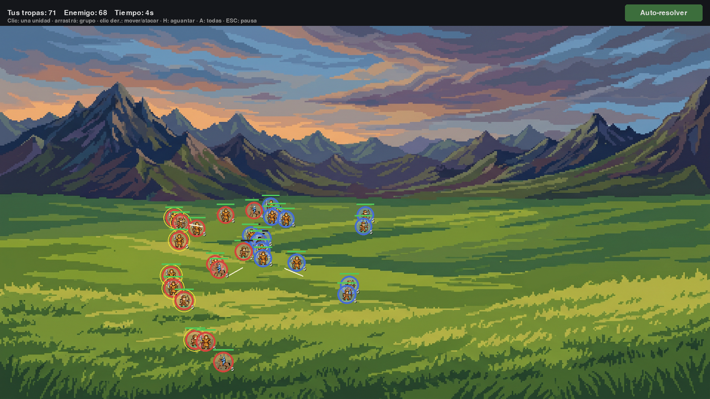
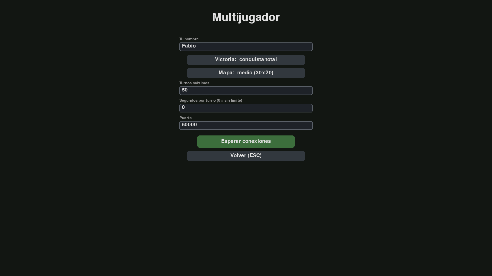
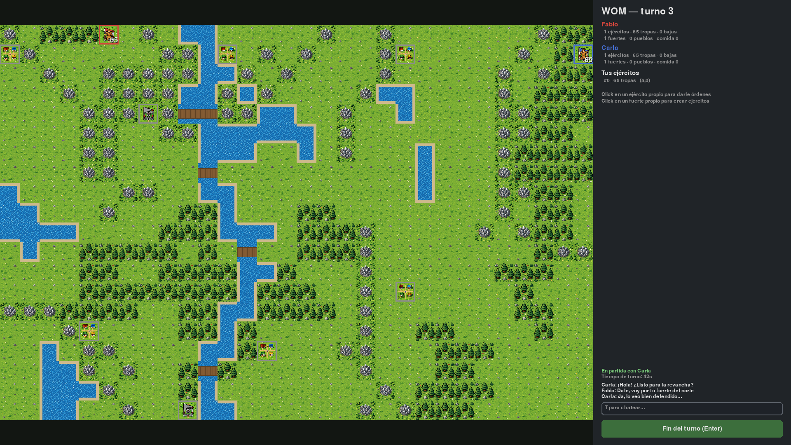

# WOM

Juego de estrategia militar 2D por turnos: jugá contra la IA o contra otra
persona por red local, sobre un mapa generado aleatoriamente con fuertes que
producen tropas, pueblos que dan comida y batallas autoresueltas. Hecho en
**Python 3.13 + pygame-ce**.



## El juego

- **Mapa aleatorio coherente**: cadenas montañosas, bosques en manchas, lagos
  y ríos con vados. Misma seed = mismo mapa (y misma partida: todo el azar es
  determinista).
- **Cuatro clases de unidad** (partisano, soldado, caballero, arquero) con
  bonus de terreno y piedra-papel-tijera entre clases. Los arqueros ignoran el
  bonus defensivo al atacar un fuerte.
- **Economía**: los pueblos producen comida, los fuertes la convierten en
  tropas que se acumulan en reserva; las tropas salen al mapa solo cuando el
  jugador crea o reabastece un ejército.
- **Batallas autoresueltas** al intentar entrar al tile de un enemigo: poder
  por composición, terreno, comida y experiencia; el perdedor se retira.
- **Zoom de batalla en tiempo real** (opcional): al chocar, el juego pregunta si
  dirigís el combate o lo auto-resuelve. Si lo dirigís, elegís una **formación de
  despliegue** (línea, clásica, compacta o en V) en la cuenta regresiva y das
  órdenes a tus tropas en vivo (mover, atacar, aguantar) en un mini-RTS, en campo
  abierto o asaltando un fuerte con su muralla y puerta. También funciona **en
  multijugador** (LAN y servidor), habilitable por partida: siempre, o solo si
  todos los jugadores del combate aceptan dirigirlo (si no, se auto-resuelve).
- **Tropas animadas**: cada clase (partisano, soldado, caballero, arquero) tiene
  animación de pose, marcha, ataque y caída, con los soldados encarándose entre
  sí, tanto en el mapa (pose y caminata) como en el zoom de batalla (ciclo
  completo, con cuerpos que se desvanecen). Las clases sin arte propio usan su
  sprite estático.
- **Tres niveles de IA** (fácil / medio / difícil) sobre un mismo motor de
  scoring de objetivos, balanceados por simulación masiva.
- **Tres modos de victoria**: conquista total, captura de banderas o límite de
  turnos.
- **Multijugador humano vs humano** de 2 a 4 jugadores: por **red local** (LAN /
  IP directa) o por **Internet** con un **servidor dedicado** (lobby con chat,
  varias partidas a la vez y reconexión); con chat en partida (ver más abajo).
- **Jugador LLM**: un modelo de lenguaje (local con Ollama/LM Studio, u online
  con Gemini, Claude o ChatGPT) puede jugar como rival, conectándose a la
  partida como un cliente de red más (ver más abajo).
- **Reorganización de ejércitos**: fusionar dos ejércitos aledaños o dividir
  uno en dos, con un modal por clase de tropa.
- **Movimiento animado** en tres fases (marcha → choque → retirada), menú
  principal y partidas guardadas en JSON (una partida cargada continúa
  exactamente igual, RNG incluido).

| Menú | Nueva partida |
| --- | --- |
|  |  |

| Mapa general | Zoom de batalla en tiempo real |
| --- | --- |
|  |  |

## Multijugador (red local)

Desde **Multijugador** en el menú: un jugador **crea** la partida (elige modo de
victoria, tamaño de mapa, turnos máximos, tiempo por turno, **zoom de batalla**
—off / acordado / siempre— y puerto) y el otro se **conecta** por IP. Ambos
quedan en una sala de espera hasta marcar «Listo».

| Crear partida | Partida en red con chat |
| --- | --- |
|  |  |

Bajo el capó es **lockstep determinista**: ambos clientes ejecutan el mismo
turno sobre las mismas órdenes y seed, así que solo viajan las órdenes por la
red (el host es la autoridad y resincroniza ante cualquier divergencia). El
panel lateral muestra el chat, el estado de la conexión y el reloj de turno
(opcional). Si un jugador sale al menú, el rival es avisado al instante.

## Multijugador por Internet (servidor dedicado)

Además del juego LAN, WOM trae un **servidor dedicado** para jugar por Internet:
un proceso stand-alone (carpeta `server/`, **solo stdlib** — sin pygame ni
assets) que se instala en un host abierto y aloja un **lobby con chat** y
**varias partidas a la vez**, actuando como **autoridad** de cada una (resuelve
los turnos y las batallas igual que el host en LAN, pero **sin ser jugador**).

Desde el cliente, en **Multijugador → Jugar por Internet**: se administra una
**lista de servidores** (guardada en `settings.json`), se entra a uno y se ve el
lobby con los jugadores conectados, el **chat global** y el **catálogo de
partidas**. Desde ahí se **crea** o se **une** a una partida; con todos «Listo»
arranca igual que en LAN. Si te caés, podés **reconectarte** a la partida en
curso (la IA cubre tu lugar mientras tanto), y al terminar volvés al lobby.

```bash
python tools/pack_server.py                       # arma el paquete mínimo (dist/wom-server)
python -m server --config server.toml --check     # valida la instalación
python -m server --config server.toml             # corre el servidor
```

Reusa el mismo lockstep determinista del modo LAN, con topes anti-DDOS
(conexiones por IP, rate-limit de mensajes, timeout de handshake) y entrada libre
o con contraseña. Diseño en [`docs/server.md`](docs/server.md); instalación,
servicio systemd y apertura de puerto/firewall en
[`docs/server_deploy.md`](docs/server_deploy.md).

## Jugador LLM (modelo de lenguaje como rival)

Un **LLM puede ocupar el lugar de un jugador**: observa el tablero, planifica,
crea y mueve ejércitos, reorganiza y pasa el turno. Se conecta a una partida
**como un cliente de red más** (no es un servidor MCP), así que aprovecha todo el
lockstep determinista del modo multijugador — el LLM solo decide las órdenes; la
simulación la siguen corriendo igual ambos lados.

Sirve para **probar qué modelo juega mejor** un juego de estrategia: corre con
modelos **locales** (Ollama, LM Studio) u **online** (Gemini, Claude, ChatGPT)
detrás de una única interfaz, sin SDKs externos.

1. Hospedá una partida desde **Multijugador → Crear** y hacé clic en
   «Esperar conexiones» (conviene poner **tiempo por turno en infinito**: el LLM
   tarda unos segundos por turno).
2. Conectá el LLM como cliente (jugador 2):

   ```powershell
   # Local con Ollama (sin API key)
   .venv\Scripts\python tools\llm_client.py --provider ollama --model gemma3 --name Gemma

   # Online (la API key se toma de la variable de entorno)
   $env:ANTHROPIC_API_KEY = "sk-ant-..."
   .venv\Scripts\python tools\llm_client.py --provider anthropic --model claude-opus-4-8 `
       --name Claude --thinking --effort high
   ```

El LLM recibe el tablero como un mapa ASCII + listas de unidades y responde con
acciones de alto nivel (mover, crear, fusionar, dividir…); el módulo calcula las
rutas con el pathfinding del core y descarta cualquier orden inválida. Diseño
completo en [`docs/llm.md`](docs/llm.md).

## Cómo jugar

**Linux / macOS**
```bash
python3 -m venv .venv
.venv/bin/pip install -r requirements.txt   # pygame-ce, pytest
.venv/bin/python main.py
```

**Windows**
```powershell
python -m venv .venv
.venv\Scripts\pip install -r requirements.txt
.venv\Scripts\python main.py
```

Click en un ejército propio para seleccionarlo y click(s) en el mapa para
trazar su camino; click en un fuerte propio para crear ejércitos desde la
reserva; `Shift+click` en otro ejército propio aledaño para fusionarlos (o
transferir tropas por clase); `D` divide el ejército seleccionado en dos. La
rueda del mouse hace zoom y el botón del medio arrastra el mapa. `Enter`
termina el turno, `G` guarda la partida, `M` abre el reproductor de música,
`T` abre el chat (en red), `ESC` vuelve al menú.

La banda de sonido suena desde `data/music` (un tema al azar al arrancar);
en **Opciones** se configura on/off, volumen, carpeta y orden
aleatorio/secuencial — todo queda guardado en `settings.json`.

### Modo headless (sin ventana)

```bash
# Linux
.venv/bin/python main.py --headless --seed 42      # IA vs IA por consola
.venv/bin/python main.py --headless --debug-ai     # con log de decisiones de la IA

# Windows
.venv\Scripts\python main.py --headless --seed 42
.venv\Scripts\python main.py --headless --debug-ai
```

## Documentación

- [`idea.md`](idea.md) — la idea original del juego.
- [`docs/especificaciones.md`](docs/especificaciones.md) — especificación
  técnica completa: modelo de dominio, fases del turno, fórmula de batalla,
  IA, persistencia y roadmap.
- [`docs/multiplayer.md`](docs/multiplayer.md) — diseño del modo multijugador
  (lockstep determinista, protocolo de red, sincronización).
- [`docs/server.md`](docs/server.md) — diseño del servidor online dedicado
  (lobby, partidas autoritativas, anti-DDOS, concurrencia).
- [`docs/server_deploy.md`](docs/server_deploy.md) — manual de despliegue del
  servidor (systemd, apertura de puerto y firewall en Linux).
- [`docs/llm.md`](docs/llm.md) — diseño del jugador LLM (observación, gramática
  de acciones, backends y cómo correrlo).
- [`CLAUDE.md`](CLAUDE.md) — guía de arquitectura para desarrollo (capas,
  invariantes, comandos).

## Arquitectura

Separación estricta en capas — `wom/core/` no importa pygame (hay un test que
lo verifica):

```
wom/core/         lógica pura: mapa, ejércitos, turnos, batallas, victoria
wom/ai/           jugadores IA (emiten las mismas Orders que un humano)
wom/ui/           pygame: render, input, menú, animaciones
wom/net/          multijugador: lockstep determinista, lobby y servidor (sin pygame)
wom/llm/          jugador LLM: observación, acciones y backends (tampoco importa pygame)
wom/persistence/  savegames JSON en saves/
server/           servidor online dedicado stand-alone (stdlib, sin pygame)
data/config/      todo el balance en JSON (clases, batalla, IA)
data/assets/      sprites PNG
```

## Assets

Los sprites viven en [`data/assets/`](data/assets/): tiles de terreno de
64×64 px, unidades de 48×48 px e íconos de 32×32 px (las banderas son
`flag_red`/`flag_blue` según el jugador y `flag` gris para sitios neutrales).
El arte se reemplaza por archivos del mismo nombre y tamaño; los placeholders
originales se conservan con prefijo `_` y se regeneran con
`tools/gen_placeholders.py`.

Las **animaciones de tropa** viven en una subcarpeta por clase
(`data/assets/<clase>/`) con la pose (`<clase>.png`), la caminata
(`<clase>-caminando-1/2`), el ataque (`<clase>-atacando-1/2/3`) y la caída
(`<clase>-muerto-1/2`); el sprite mira a la derecha (el juego lo espeja según el
bando). Agregar una clase a la animación es sumar su carpeta y una entrada en
`UNIT_ANIMATIONS` (`wom/ui/assets.py`); sin carpeta, la clase usa su sprite
estático.

## Tests y herramientas

**Linux**
```bash
.venv/bin/python -m pytest tests -v                            # suite completa
PYTHONPATH=. .venv/bin/python tools/simulate.py --games 30       # balance IA vs IA
PYTHONPATH=. .venv/bin/python tools/screenshot_m2.py             # captura headless del juego
PYTHONPATH=. .venv/bin/python tools/screenshot_battle.py         # captura del zoom de batalla
PYTHONPATH=. .venv/bin/python tools/screenshot_multiplayer.py    # capturas del modo en red
```

**Windows**
```powershell
.venv\Scripts\python -m pytest tests -v
$env:PYTHONPATH='D:\dev\WOM'; .venv\Scripts\python tools\simulate.py --games 30
$env:PYTHONPATH='D:\dev\WOM'; .venv\Scripts\python tools\screenshot_m2.py
$env:PYTHONPATH='D:\dev\WOM'; .venv\Scripts\python tools\screenshot_battle.py
$env:PYTHONPATH='D:\dev\WOM'; .venv\Scripts\python tools\screenshot_multiplayer.py
```

Los scripts de `tools/` necesitan la raíz del proyecto en `PYTHONPATH`.

## Build distribuible

```bash
pip install pyinstaller
pyinstaller wom.spec    # genera dist/wom/ (ejecutable + data/ adentro)
```

El bundle es portable: `saves/` y `settings.json` se crean junto al
ejecutable. PyInstaller no cruza plataformas: el build de Linux se hace en
Linux — lo resuelve el workflow de GitHub Actions
([`build.yml`](.github/workflows/build.yml)). Para publicar una versión
alcanza con taguear:

```bash
git tag -a v0.4.1 -m "Versión 0.4.1"
git push origin v0.4.1
```

El workflow corre los tests, compila en Windows, Linux y macOS (arm64), y
**publica el release automáticamente** con `wom-vX.Y.Z-windows.zip`,
`wom-vX.Y.Z-linux.tar.gz` y `wom-vX.Y.Z-macos-arm64.tar.gz` adjuntos (tar.gz
para conservar el permiso de ejecución del binario) y changelog generado.

## Autor

**Fabio Baccaglioni** — <fabiomb@gmail.com>
